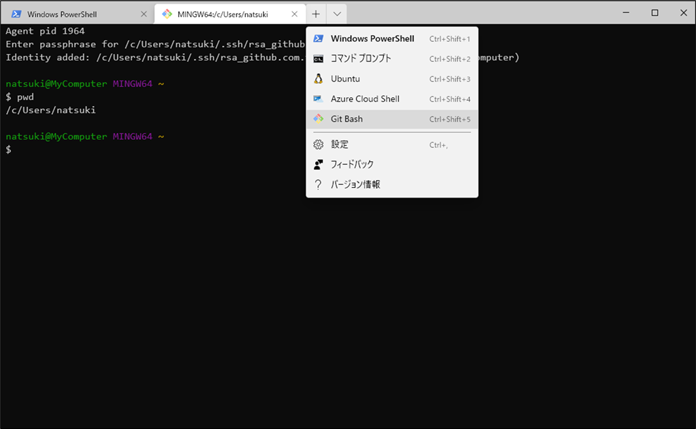

# Windows Terminal を導入する方法
Windows Terminal を Scoop でインストールし、Git Bash を Windows Terminal で開けるようにするまでを説明する。

## Windows Terminal とは
Windows Terminalとは、Microsoft 社が開発した端末エミュレーターである。

Windows で使えるコマンドライン入力ツールには、コマンドプロンプト、PowerShell、Linux 用 Windows サブシステム (WSL) など、様々な種類がある。が、今まではすべて別々のインタフェースで立ち上げなければいけなかった。

Windows Terminal は、これら複数のコマンドラインツールを1つのインタフェースにタブで表示して使えるようにしたツールである。

## インストール方法
今回は Scoop を使ってインストールする。Scoop を導入していない場合は、以下のページを参照する。

Scoop とは（メリットと使い方）:  
https://github.com/fs5013-furi-sutao/explain.scoop

まず、Windows Terminal がどの bucket にあるかを調べる。

Windows Terminal のマニフェストがある場所を探す:
```console
scoop search windows-terminal
```
実行結果;
```
'extras' bucket:
    windows-terminal (1.3.2651.0)
```

extras バケットにあることが分かる。自分のローカルにある bucket を確認する。

ローカルに存在する bucket を表示する:
```console
scoop bucket list
```

extras バケットが表示されない場合は、以下のコマンドでバケットを追加する。

extras バケットを追加する。
```console
scoop bucket add extras
```

これで準備は整ったので、インストールを行う。

Windows Terminal をインストールする:
```console
scoop install windows-terminal
```

## Git Bash を登録する
デフォルト設定では Git Bash は Windows Terminal では開けない。Git Bash を登録して、Windows Terminal で使えるようにする。

そもそも Git for Windows をインストールしていない場合は、インストールを済ませておく。

Git for Windows をインストール:
```console
scoop install git
```

### GUID を取得する
Git Bash の登録に使う GUID を入手する。GUID は一意となるハッシュ値で、登録するツールの識別子に利用する。

GUID を入手する:
```console
[guid]::NewGuid()
```
実行結果例:
```
7c225262-f393-8bb1-c90a-1d4eb0f2d07a
```

発行された GUID は控えておく。

### 
Windows Terminal のヘッダ部にある「V」マークをクリックする。

メニューが開くので、その中から「設定」を選択。

settings.json ファイルが開いたら、profiles プロパティの list 配列に以下のオブジェクトを追加する。

追記するオブジェクト:  
```json
,
            {
                "guid" : "{●●●●}",
                "acrylicOpacity" : 1.0,
                "closeOnExit" : true,
                "colorScheme" : "Campbell",
                "commandline" : "\"C:\\Users\\%USERNAME%\\scoop\\apps\\git\\current\\bin\\bash.exe\" --login -i -l",
                "cursorColor" : "#FFFFFF",
                "cursorShape" : "bar",
                "fontFace" : "consolas",
                "fontSize" : 12,
                "historySize" : 9001,
                "icon" : "C:\\Users\\%USERNAME%\\scoop\\apps\\git\\current\\mingw64\\share\\git\\git-for-windows.ico",
                "name" : "Git Bash",
                "padding" : "10, 0, 10, 0",
                "snapOnInput" : true,
                "startingDirectory" : "%USERPROFILE%"
            }
```

「●●●●」の部分は、先に入手しておいた GUID に置き換える。


